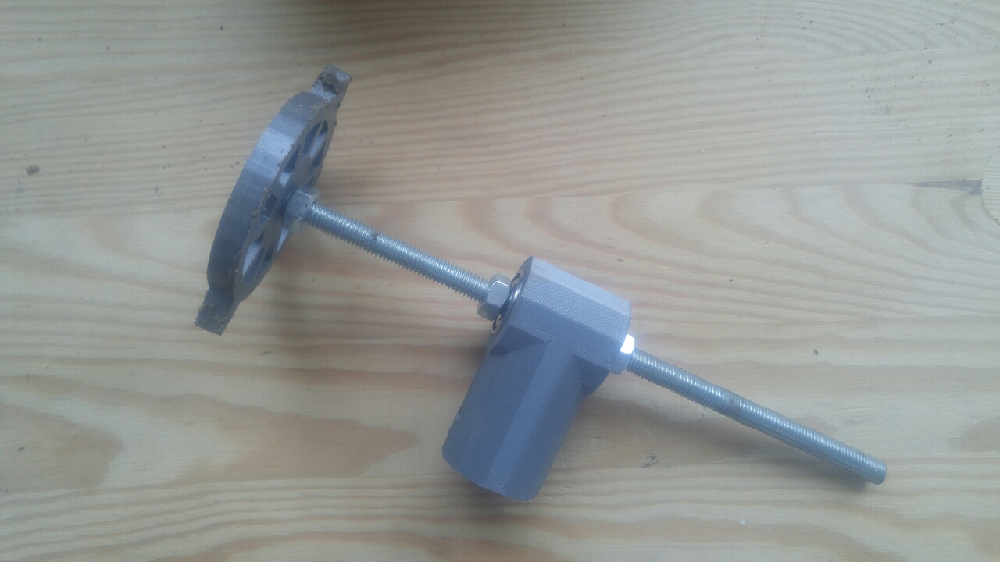

# Gahoma

>*Gahoma* aka garden-hole-maker: simple 3d printed tool for making holes to plant onions 

Designed and 3d printed a small and simple tool to make aligned and well spaces holes to plant onions in !
- The design is parametric so you can set the desired distance / size for the holes. 
- you can just set the right row distance by tightening the wheels( only one printed so far) at the desired distance
- no back breaking : the central part is mean to put a wooden /pvc/ whatever rod so you can just roll it on the floor without bending over

## Table of Contents

- [Usage](#usage)
- [License](#license)

## Usage

This package can currently only be used in the prototype V2 version of OpenJSCAD (written as npm module): to do so 
- download the content of this repository
- head over to https://jscad.xyz/playground.html
- drag & drop the folder of this repository (gahoma) anywhere onto https://jscad.xyz/playground.html 
- play around with the parameters, tweak the code, export as stl, have fun !

> note: this is an early experimental version, so things might break/ get weird

## License

[The MIT License (MIT)](./LICENSE)
(unless specified otherwise)